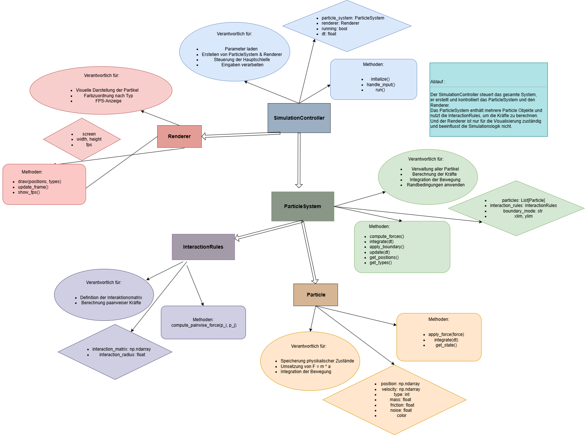

# Particle Life Simulator

## Project Idea

This project is a Particle Life simulation where thousands of particles move in a 2D space and interact with each other. Each particle has a type (shown as a color), and the interaction between types is defined in a matrix. Depending on the values in this matrix, particles can attract, repel, or ignore each other.

Even though the rules are simple, the movement of many particles at the same time creates complex and interesting patterns. The goal of this project is to simulate this behavior, make it visible, and keep the performance high enough so that the simulation runs smoothly with many particles.

---

## What This Project Includes

### 1. Simulation
	-   Particle class with position, velocity, and type
	- 	Simulation loop that updates movement and applies interaction forces
	-	Interaction matrix for attraction and repulsion
	-	Adjustable parameters (interaction strength, friction, radius, etc.)
	-	Optional real-time visualization or video output
	- 	Support for large particle counts (1000+)
	- 	Modular architecture separating physics, interaction logic, and rendering

### 2. Code Quality
	-	Clean and readable code
	-	Docstrings in important classes and functions
	-	Unit tests (about 70-80% coverage)
	-	Continuous Integration (GitHub Actions on Linux, macOS, Windows)
	-   Automatic formatting check using Black

### 3. Performance
	-	Profiling to find performance issues
	-	Optimization using:
	-	NumPy
	-	better algorithms
	-	optional numba or parallelization
	-	Target: at least 1000–2000 particles running smoothly

### 4. Project Management
	-	GitHub repository with Issues and Kanban board
	-	Development through branches and pull requests
	-	Code reviews inside the team
	-	Regular weekly updates during the project

### 5. Documentation & Presentation
	-	README for users and developers
	-	Architecture overview (diagram)
	    
	-	Final presentation of the project
	-	Complete documentation at the end

---

## Requirements
-   Python 3.10 or newer
-   pip
- 	Git (optional, required only for cloning the repository)

---

## Installation
-	Clone the repository:
  	- git clone https://github.com/lbrpxiii/particle-life-simulator.git
	- cd particle-life-simulator

-	Create and activate a virtual environment
	- MacOS/Linux:
		- python3 -m venv .venv
		- source .venv/bin/activate
    
	- Windows:
		- python -m venv .venv
		- .venv\Scripts\activate

-	Install dependencies:
	- pip install -r requirements.txt

---

## Run the Simulation
-	python3 -m src.simulation_controller

 ### Controls (Pygame Simulation)

- SPACE – Pause / Resume
- ↑ / ↓ – Increase / decrease interaction strength
- ← / → – Increase / decrease friction
- ESC – Quit simulation 

---

## Run tests

- Run all tests:
  - `pytest`

- Run tests with coverage:
  - `pytest --cov=src --cov-report=term-missing`

Note: Coverage requires the `pytest-cov` package, which is included in `requirements.txt`.

---

## Format Code (Black)
-	black src tests

---

## Performance & Profiling

Performance profiling was conducted using Python’s built-in `cProfile` to identify computational bottlenecks.

Profiling results show that over 99% of the total runtime is spent in the `compute_forces()` function. This confirms the expected O(N²) complexity of pairwise particle interactions.

Example profiling result:
- ~21 million distance calculations
- ~145 seconds spent in `compute_forces`
- negligible time in integration and boundary handling

The main performance bottleneck is the repeated pairwise distance
computation between particles.

Profiling scripts and results can be found in the `profiling/` directory.

___

## Developer documentation

### Paiman – Physics & System Architecture
- Implementation of the Particle class and the ParticleSystem
- Integration logic (forces → motion update)
- Boundary condition handling
- Performance optimization using NumPy (≥1000 particles)
- Tests for the particle system and boundary handling
  

### Sabrina – Interaction Logic & Forces
- Implementation of the InteractionRules
- Interaction matrix & compute_forces()
- Parameterization of interaction range and strength
- Development and validation of the interaction logic through tests
- Test and CI stabilization
- Project infrastructure and documentation
  

### Yaman – Visualization & Integration
- Implementation of the PygameRenderer
- Real-time rendering with color-coded particle types
- FPS display (current & average)
- Renderer tests and coverage improvement (~77%)

